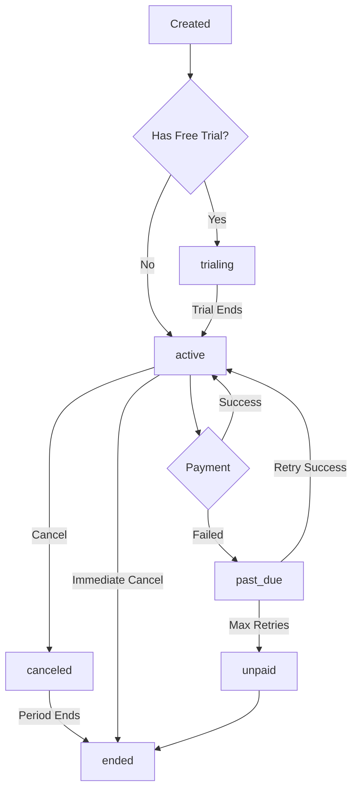

## Overview

The **billing lifecycle** describes how customer subscriptions progress from creation through renewal, upgrades, cancellation, and expiration. Autumn handles all the complexity of managing this lifecycle automatically.

## Subscription States

Customer subscriptions (`CustomerProduct`) go through several states:



### State Definitions

**`trialing`**
- Customer is in free trial period
- Full access to features
- No payment required yet
- Automatically transitions to `active` when trial ends

**`active`**
- Subscription is active and paid
- Customer has full access
- Recurring billing happens automatically

**`past_due`**
- Payment failed but subscription still active
- Stripe retries payment automatically
- Customer may have limited access (configurable)
- Transitions to `unpaid` after max retry attempts

**`canceled`**
- Subscription is canceled but still active until period end
- Customer retains access until `ended_at` timestamp
- No renewal will occur

**`unpaid`**
- Payment failed after all retry attempts
- Subscription is effectively ended
- Customer loses access

**`ended`**
- Subscription fully terminated
- No access to features
- Can be reactivated by attaching a new product

## Billing Cycles

Billing cycles determine when customers are charged:

### Subscription Billing

Recurring charges happen at the interval defined in the price:

```typescript
// Monthly billing - charge on the same day each month
{
  config: {
    type: "fixed",
    amount: 2900,
    interval: "month"
  }
}

// Timeline:
// Jan 15: Customer subscribes → Charged $29
// Feb 15: Billing cycle renews → Charged $29
// Mar 15: Billing cycle renews → Charged $29
```

Annual billing:

```typescript
{
  config: {
    type: "fixed",
    amount: 29900,
    interval: "year"
  }
}

// Timeline:
// Jan 15, 2024: Customer subscribes → Charged $299
// Jan 15, 2025: Billing cycle renews → Charged $299
```

### Billing Anchor

The billing anchor determines when the first charge occurs and sets the cycle:

```typescript
await attach({
  productId: "pro",
  billingAnchor: 1704153600000  // Specific Unix timestamp
});
```

<Info>
  By default, the billing anchor is set to the subscription start time. You can customize it to align billing across multiple subscriptions or to a specific day of the month.
</Info>

### Usage Billing

Usage-based charges are billed at the end of each period:

```typescript
{
  config: {
    type: "usage",
    feature_id: "api_calls",
    bill_when: "end_of_period",
    interval: "month",
    usage_tiers: [{ to: "infinite", amount: 0.1 }]
  }
}

// Timeline:
// Jan 15: Billing period starts
// Jan 15-Feb 14: Customer makes 50,000 API calls
// Feb 15: Invoice generated for $50 (50,000 × $0.001)
```

Prepaid usage is billed upfront:

```typescript
{
  config: {
    type: "usage",
    feature_id: "api_calls",
    bill_when: "in_advance",
    interval: "month",
    usage_tiers: [{ to: "infinite", amount: 0 }]
  },
  entitlement: {
    allowance: 10000
  }
}

// Timeline:
// Jan 15: Customer purchases → Charged $29, receives 10,000 calls
// Jan 15-Feb 14: Customer uses calls from allowance
// Feb 15: Allowance resets to 10,000, charged $29 again
```

## Subscription Creation

When a customer subscribes via `/attach`:

### 1. Product Attachment

```typescript
const { attach } = useAutumn();

const result = await attach({
  customerId: "user_123",
  productId: "pro"
});
```

### 2. Checkout Flow

For paid products, Autumn returns a Stripe Checkout URL:

```typescript
{
  checkout_url: "https://checkout.stripe.com/c/pay/...",
  scenario: "new_product"
}
```

Redirect the customer to complete payment:

```typescript
if (result.checkout_url) {
  window.location.href = result.checkout_url;
}
```

### 3. Subscription Activation

After successful payment:

1. Stripe sends webhook to Autumn
2. Autumn creates `CustomerProduct` record with `status: "active"`
3. Customer gets immediate access to features
4. Entitlements are activated

```typescript
{
  id: "cp_abc123",
  product_id: "pro",
  status: "active",
  starts_at: 1704067200000,
  created_at: 1704067200000,
  subscription_ids: ["sub_stripe123"]
}
```

## Free Trials

Free trials give customers temporary access before payment:

```typescript
// Product with 14-day free trial
{
  id: "pro",
  prices: [/* ... */],
  free_trial: {
    interval: "day",
    interval_count: 14
  }
}
```

Trial timeline:

```typescript
// Day 0: Customer starts trial
{
  status: "trialing",
  trial_ends_at: 1705276800000,  // 14 days from now
  starts_at: 1704067200000
}

// Day 1-13: Customer has full access
// - All features available
// - No charges
// - Can cancel anytime

// Day 14: Trial ends
// - Stripe charges the customer
// - Status changes to "active"
// - Subscription continues automatically
```

Disable free trial for specific customers:

```typescript
await attach({
  productId: "pro",
  disableFreeTrial: true  // Skip trial, charge immediately
});
```

<Note>
  Customers can only use each free trial once. If they previously trialed a product, they'll be charged immediately on re-subscription.
</Note>

## Upgrades and Downgrades

Autumn automatically handles plan changes:

### Upgrade (to higher-priced plan)

```typescript
// Customer on Starter ($9/mo) upgrades to Pro ($29/mo)
await attach({
  productId: "pro"  // Autumn detects this is an upgrade
});
```

What happens:
1. **Proration calculated**: Customer gets credit for unused time on Starter
2. **Immediate charge**: Prorated amount for Pro plan
3. **Access granted**: Instant access to Pro features
4. **Billing aligned**: Next charge on original billing date

Example:
```
Starter: $9/mo, subscribed on Jan 1
Upgrade to Pro ($29/mo) on Jan 15 (halfway through month)

Proration:
- Credit for unused Starter: $4.50 (15 days remaining)
- Charge for Pro (15 days): $14.50
- Immediate charge: $14.50 - $4.50 = $10.00

Next charge: Feb 1 for full $29.00
```

### Downgrade (to lower-priced plan)

```typescript
// Customer on Pro ($29/mo) downgrades to Starter ($9/mo)  
await attach({
  productId: "starter"  // Autumn detects this is a downgrade
});
```

What happens:
1. **Schedule change**: Downgrade scheduled for end of billing period
2. **Continued access**: Customer keeps Pro until period ends
3. **No immediate charge**: Credit applied to next invoice
4. **Switch occurs**: Starter plan activates on renewal date

<Info>
  Downgrades are scheduled (not immediate) to ensure customers get the full value of what they paid for.
</Info>

## Add-ons

Add-on products can be attached alongside base plans:

```typescript
// Customer has Pro plan, adds Priority Support
await attach({
  productId: "priority_support"  // is_add_on: true
});
```

Customer now has:
```typescript
customer_products: [
  {
    product_id: "pro",
    status: "active"
  },
  {
    product_id: "priority_support",
    status: "active"
  }
]
```

Billing:
- Both subscriptions bill independently
- Can have different billing cycles
- Can be canceled independently

## Cancellation

Two types of cancellation:

### 1. End of Period Cancellation

```typescript
// Cancel at end of billing period (default)
// Customer retains access until period ends
```

Timeline:
```
Jan 15: Subscription starts ($29/mo)
Jan 20: Customer cancels
Jan 20-Feb 14: Customer still has access
Feb 15: Subscription ends, access revoked
```

Customer product state:
```typescript
{
  status: "active",
  canceled: true,
  canceled_at: 1704499200000,  // Jan 20
  ended_at: 1706140800000      // Feb 15
}
```

### 2. Immediate Cancellation

```typescript
// Cancel immediately and revoke access
// May issue prorated refund
```

Customer product state:
```typescript
{
  status: "ended",
  canceled: true,
  canceled_at: 1704499200000,
  ended_at: 1704499200000      // Same timestamp
}
```

## Payment Failures

When a payment fails:

### 1. Initial Failure
```typescript
{
  status: "past_due",
  // Customer may still have access (configurable)
}
```

### 2. Automatic Retries

Stripe automatically retries failed payments:
- Retry 1: After 3 days
- Retry 2: After 5 days  
- Retry 3: After 7 days
- Retry 4: After 9 days

### 3. Successful Retry
```typescript
{
  status: "active",
  // Subscription restored
}
```

### 4. Final Failure
```typescript
{
  status: "unpaid",
  ended_at: 1704758400000,
  // Access revoked
}
```

<Tip>
  Configure dunning emails in Stripe to automatically remind customers about failed payments.
</Tip>

## Invoices

Autumn generates invoices for all charges:

```typescript
type Invoice = {
  id: string;
  stripe_id: string;             // Stripe invoice ID
  internal_customer_id: string;
  
  amount_due: number;            // Total amount in cents
  amount_paid: number;
  status: string;                // "draft", "open", "paid", "void"
  
  period_start: number;
  period_end: number;
  
  created_at: number;
  due_date: number | null;
};
```

Invoice line items:
```typescript
type InvoiceLineItem = {
  description: string;
  amount: number;
  quantity: number;
  
  // Links to what was charged
  internal_price_id: string;
  internal_product_id: string;
};
```

Example invoice:
```typescript
{
  id: "inv_abc123",
  amount_due: 11250,
  status: "paid",
  line_items: [
    {
      description: "Pro Plan",
      amount: 2900,              // $29.00
      quantity: 1
    },
    {
      description: "API Calls overage (12,500 calls)",
      amount: 1875,              // $18.75
      quantity: 12500
    },
    {
      description: "Additional seats (3 seats)",
      amount: 4500,              // $45.00  
      quantity: 3
    }
  ]
}
```

## Subscriptions Object

Autumn tracks Stripe subscriptions:

```typescript
type Subscription = {
  id: string;
  stripe_id: string | null;           // Stripe subscription ID
  stripe_schedule_id: string | null;  // Stripe schedule ID
  
  current_period_start: number | null;
  current_period_end: number | null;
  
  usage_features: string[];           // Features being metered
  
  org_id: string;
  env: string;
  created_at: number;
};
```

Autumn uses this to:
- Track billing periods
- Aggregate usage across multiple features
- Sync with Stripe subscription lifecycle

## Next Steps

- Learn about [Products and Plans](/concepts/products-and-plans) to understand what customers subscribe to
- Explore [Pricing Models](/concepts/pricing-models) to configure billing
- Read about [Customers](/concepts/customers) to manage customer state
- Check the [API Reference](/api) for `/attach` and subscription management
