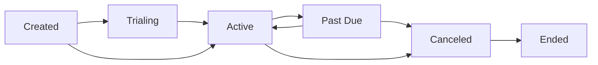

## Overview

**Customers** are the end-users or organizations that subscribe to your products. In Autumn, customers are the central entity that connects to products, tracks usage, and manages billing.

## Customer Structure

```typescript
type Customer = {
  internal_id: string;           // Internal database identifier
  id: string | null;             // Your application's customer ID
  org_id: string;                // Your organization ID
  
  // Identity
  name: string | null;
  email: string | null;
  fingerprint: string | null;    // Anonymous user tracking
  
  // Environment
  env: "test" | "prod";
  
  // Payment processor
  processor: {
    type: "stripe";
    id: string;                  // Stripe customer ID
  } | null;
  
  // Configuration
  metadata: Record<string, unknown>;
  send_email_receipts: boolean;
  
  created_at: number;
};
```

### Customer Identity

Autumn provides flexible customer identification:

**1. Identified Customers**

Customers with a known `id` from your application:

```typescript
const { attach } = useAutumn();

// Attach product to a specific customer
await attach({
  customerId: "user_123",
  productId: "pro"
});
```

**2. Anonymous Customers**

Users tracked by fingerprint before signing up:

```typescript
{
  id: null,
  email: "guest@example.com",
  fingerprint: "fp_abc123",  // Browser/device fingerprint
}
```

<Note>
  When an anonymous customer signs up, you can update their record to include an `id`, preserving their usage history and subscriptions.
</Note>

**3. Email-only Customers**

Customers identified by email:

```typescript
{
  id: null,
  email: "customer@example.com",
  fingerprint: null,
}
```

## Full Customer Object

When querying customers through the API, you'll often work with `FullCustomer`:

```typescript
type FullCustomer = Customer & {
  customer_products: FullCusProduct[];     // Active subscriptions
  entities: Entity[];                      // Multi-entity support
};
```

Example:

```typescript
const customer: FullCustomer = {
  id: "user_123",
  email: "alice@acme.com",
  name: "Alice Johnson",
  // ... other customer fields
  
  customer_products: [
    {
      product_id: "pro",
      status: "active",
      starts_at: 1704067200000,
      // ... subscription details
    }
  ],
  
  entities: [
    {
      id: "acme_workspace_1",
      type: "workspace",
      // ... entity details
    }
  ]
};
```

## Customer Products

When a customer subscribes to a product, a `CustomerProduct` record is created:

```typescript
type CustomerProduct = {
  id: string;
  internal_customer_id: string;
  internal_product_id: string;
  product_id: string;            // User-facing product ID
  
  // Status tracking
  status: string;                // "active", "trialing", "past_due", etc.
  canceled: boolean;
  canceled_at: number | null;
  
  // Timing
  created_at: number;
  starts_at: number | null;      // When product becomes active
  ended_at: number | null;       // When product ended
  trial_ends_at: number | null;  // Free trial expiration
  
  // Free trial
  free_trial_id: string | null;
  
  // Configuration
  options: any[];                // Feature-specific options (e.g., quantity)
  quantity: number;              // For seat-based pricing
  collection_method: string;     // "charge_automatically" or "send_invoice"
  
  // Payment processor
  processor: {
    type: "stripe" | "revenuecat";
    id: string;                  // Subscription ID in processor
  } | null;
  
  subscription_ids: string[];    // Stripe subscription IDs
  scheduled_ids: string[];       // Scheduled changes
  
  // Metadata
  is_custom: boolean;            // Custom pricing for this customer
  api_version: number;
  external_id: string | null;    // Your external reference
};
```

### Customer Product Lifecycle

A customer product goes through several states:



**Common statuses:**

- `trialing` - In free trial period
- `active` - Active subscription with valid payment
- `past_due` - Payment failed, retrying
- `canceled` - Canceled but still active until period ends
- `ended` - Subscription fully terminated

### Checking Customer Access

Use the `/check` endpoint to verify what a customer can access:

```typescript
const { check } = useAutumn();

// Check if customer has access to a product
const { data } = await check({ 
  customerId: "user_123",
  productId: "pro" 
});

if (data.allowed) {
  // Customer has active Pro subscription
}
```

See [Features](/concepts/features) for checking feature-level access.

## Entities

Entities enable **multi-tenancy** within a single customer account. This is useful for:

- Workspaces in team collaboration tools
- Projects in development platforms  
- Organizations in B2B SaaS
- Stores in e-commerce platforms

```typescript
type Entity = {
  internal_id: string;
  id: string;                    // Your entity identifier
  internal_customer_id: string;  // Parent customer
  
  type: string | null;           // "workspace", "project", etc.
  metadata: Record<string, unknown>;
  
  created_at: number;
};
```

### Using Entities

Attach products to specific entities:

```typescript
const { attach } = useAutumn();

// Attach product to a specific workspace
await attach({
  customerId: "user_123",
  entityId: "workspace_abc",
  productId: "team"
});
```

Track usage per entity:

```typescript
const { track } = useAutumn();

await track({
  customerId: "user_123",
  entityId: "workspace_abc",
  featureId: "api_calls",
  value: 100
});
```

<Info>
  Each entity can have its own products and usage tracking, allowing you to bill different teams or projects separately within the same customer account.
</Info>

## Customer Options

When attaching products, you can specify feature-specific options:

```typescript
type FeatureOptions = {
  feature_id: string;
  internal_feature_id: string;
  quantity: number;              // e.g., number of seats purchased
};
```

Example with seat-based pricing:

```typescript
await attach({
  customerId: "user_123",
  productId: "team",
  options: [
    {
      feature_id: "seats",
      quantity: 5               // Purchase 5 seats
    }
  ]
});
```

## Customer Metadata

Store arbitrary data on customer records:

```typescript
{
  id: "user_123",
  email: "alice@acme.com",
  metadata: {
    company: "Acme Corp",
    industry: "Technology",
    signup_source: "google_ads",
    account_manager: "john@yourcompany.com"
  }
}
```

Metadata is:
- Stored as JSON
- Synced to Stripe (if using Stripe)
- Queryable through the API
- Useful for segmentation and analytics

## Customer Creation

Customers are created automatically when you call `/attach` or `/track` with a new customer ID:

```typescript
// First call creates the customer
await attach({
  customerId: "user_789",     // New customer
  productId: "pro"
});
```

You can also create customers explicitly through the API or dashboard.

## Stripe Integration

When Stripe is connected, Autumn automatically:

1. **Creates Stripe customers** when attaching products
2. **Syncs customer data** (name, email, metadata) to Stripe
3. **Manages payment methods** through Stripe
4. **Handles webhooks** for subscription events

```typescript
{
  id: "user_123",
  email: "alice@acme.com",
  processor: {
    type: "stripe",
    id: "cus_abc123"           // Stripe customer ID
  }
}
```

<Tip>
  Autumn handles all the complexity of syncing customer state between your app and Stripe, so you never have to write webhook handlers.
</Tip>

## Customer Queries

Common customer operations:

```typescript
// Get customer with all products
const customer = await getFullCustomer({ 
  customerId: "user_123" 
});

// Check active subscriptions
const activeProducts = customer.customer_products.filter(
  cp => cp.status === "active" && !cp.canceled
);

// Find customer by email
const customer = await findCustomerByEmail({
  email: "alice@acme.com",
  env: "prod"
});
```

## Next Steps

- Learn about [Products and Plans](/concepts/products-and-plans) to understand what customers subscribe to
- Explore [Features](/concepts/features) to control what customers can access
- Read about [Billing Lifecycle](/concepts/billing-lifecycle) to understand subscription states
